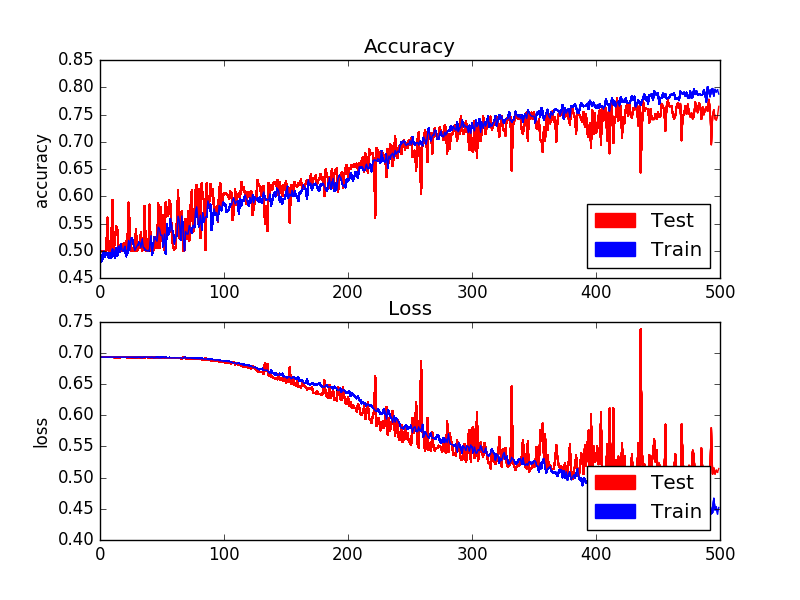

# SqueezeNet Keras Dogs vs. Cats demo

I'm surprised **SqueezeNet** has generated so little hype in the Deep Learning community - it promises **AlexNet** accuracy with 50x fewer parameters. That is exciting, right? Let's 
put it to the test.

For the demo I used the Keras implementation of the Kaggle Dogs vs. Cats dataset as base and the [DT42](https://github.com/DT42/squeezenet_demo/blob/master/model.py) implementation 
of the **SqueezeNet** architecture. I didn't spent much time fine tuning the hyper parameters and have intiuitively gone for a SGD optimizer with a small learning rate. As can be 
seen from the graph below training progressed steadily before the training accuracy seperates from the validation accuracy peaking at around +/-0.8 accuracy. Pretty impressive on 
a small data set of only 2000 training images.

Even more impressive though is the number of parameters and the size of the weights when saved. The Keras model I used for the demo has ~736000 parameters and only takes up 
3MB of diskspace. To put in perspective compare to a VGG16 model that uses 138 million parameters and a weights file when saved to disk of over 500MB. Magnitudes smaller.

This might not mean much in a server-side world where processing power is scallable and memory cheap, but if you are looking at using **Deep Learning** on small form factor computers,
e.g. a **Raspberry Pi**, this is exciting. 

### References:

[SqueezeNet: AlexNet-level accuracy with 50x fewer parameters and ,0.5MB model size](https://arxiv.org/abs/1602.07360)

[GitHub: DeepScale/SqueezeNet](https://github.com/DeepScale/SqueezeNet)

[Dogs vs. Cats Redux: Kernels Edition](https://www.kaggle.com/c/dogs-vs-cats-redux-kernels-edition)

[Building powerful image classification models using very little data](https://blog.keras.io/building-powerful-image-classification-models-using-very-little-data.html)

[SqueezeNet Keras Implementation](https://github.com/DT42/squeezenet_demo)